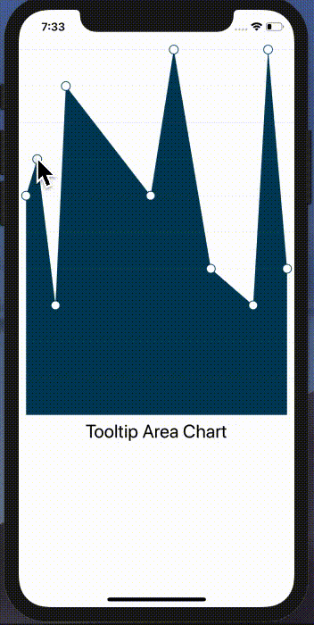

# React Native Tooltip Chart
A react-native-svg-charts implementation with dynamic tappable tooltips.

Read more about this on [Medium](https://medium.com/better-programming/how-to-build-react-native-charts-with-dynamic-tooltips-64aefc550c95)



## Installation
### npm modules
```npm install```
or
```yarn```

## Usage
```react-native run-ios```
or
```react-native run-android```

## License
Licensed under the [MIT](https://github.com/vikrantnegi/react-native-tooltip-chart/blob/master/LICENSE).
